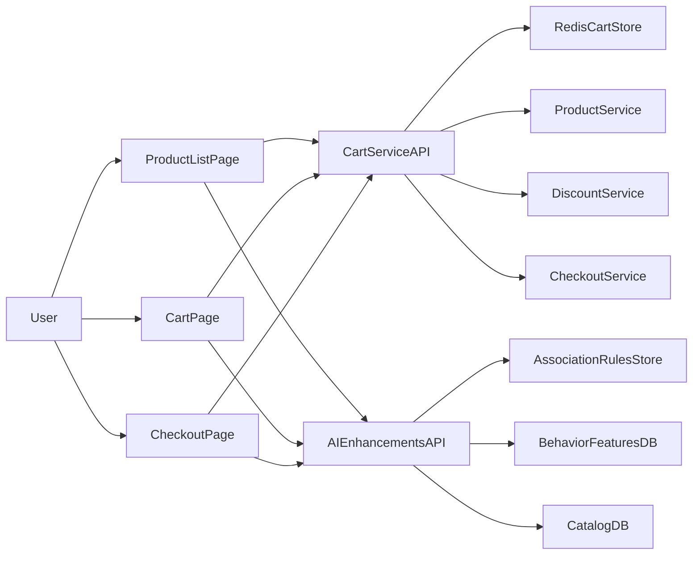

# E-commerce Cart System Design Plan

## Scope

Design a backend-first cart system in `Python + FastAPI` with:

- Cart operations: `addItem(productId, quantity)`, `removeItem(productId)`, `updateQuantity(productId, quantity)`
- Checkout support: total calculation and discount application
- APIs: `POST /cart/items`, `GET /cart`, `PATCH /cart/items/{productId}`, `DELETE /cart/items/{productId}`, `POST /cart/checkout`
- UI pages: product list, cart page, checkout page
- Core structure: hashmap-style cart representation (`productId -> quantity`)

## Architecture (High-Level)

- **Frontend (Web/App)**
  - Product list page: product catalog + “Add to Cart” actions
  - Cart page: list selected items, update quantity, remove item
  - Checkout page: pricing summary, discounts, final confirmation
- **Cart Service (FastAPI)**
  - Owns cart state and cart operations
  - Validates product existence/availability via Product service
  - Uses pricing data and discount rules to compute cart totals
- **Recommendation Service (AI)**
  - Provides three AI enhancements: association-rule recommendations, upselling, and price-sensitivity prediction
  - Kept out of the cart mutation critical path (best-effort + cached results)
- **Data Stores**
  - Redis: active cart storage for low-latency reads/writes
  - PostgreSQL: order history, discount metadata, recommendation training datasets/features/logs

## Data Model (Conceptual)

- **Cart**
  - `cartId`, `userId/sessionId`, `items`, `currency`, `updatedAt`
- **CartItem**
  - `productId`, `quantity`, `unitPriceSnapshot`, `lineTotal`
- **Discount**
  - `discountId`, `type` (percent/fixed/free-shipping), `rules`, `validity`
- **CheckoutSummary**
  - `subtotal`, `discountAmount`, `tax`, `shipping`, `grandTotal`

Cart internal representation example:

- `itemsMap: { productId: quantity }`
- Enriched at read-time with product metadata (name, price, image)

## API Design (High-Level)

- `POST /cart/items`
  - Add item; if existing item, increment quantity
- `GET /cart`
  - Return cart items + pricing summary (best-effort estimate) + cached AI enhancements block
- `PATCH /cart/items/{productId}`
  - Update quantity; if quantity = 0, remove item
- `DELETE /cart/items/{productId}`
  - Remove item explicitly
- `POST /cart/checkout`
  - Lock pricing snapshot, apply discounts, validate stock, return payable total

Optional AI endpoints (separate so checkout/cart mutations stay fast):

- `GET /ai/recommendations?cartId=...`
  - Frequently-bought-together recommendations using association rules (Apriori)
- `GET /ai/upsell?cartId=...`
  - Higher-value alternatives and bundle upgrades with guardrails
- `GET /ai/price-sensitivity?cartId=...`
  - Purchase-likelihood score and/or sensitivity segment for personalization

## Core Business Rules

- Quantity must be positive integer (except update-to-zero semantics)
- Max quantity per SKU configurable
- Fast updates: cart mutations must not depend on AI calls and should avoid heavyweight repricing
- Accurate pricing: totals are always revalidated at checkout to avoid stale totals
- Out-of-stock handling at add/update (best-effort) and again at checkout (authoritative)
- Cart expiration for anonymous users (TTL in Redis)

## Recommendation Strategy (Initial)

- Phase 1: heuristic recommendations (co-purchase + category similarity + top sellers)
- Phase 2: lightweight ML ranking model based on click/cart/purchase signals
- Trigger recommendation refresh on cart changes (`add/update/remove`)
- Keep recommendation service independent to iterate without touching cart core

## AI Enhancements (Requested)

### 1) Product Recommendation (Association Rules via Apriori)

- **Goal**: Recommend products based on current cart items using “frequently bought together” patterns.
- **Training data**: historical baskets (orders) represented as itemsets of `productId`s.
- **Rules**: generate rules **A → B** where **confidence = support(A ∪ B) / support(A)**; rank by **lift** to reduce popularity bias.
- **Serving**: precompute and store top rules for common antecedents (single items + popular pairs) for fast lookup; refresh on a schedule and/or incrementally from new orders.
- **Online request**: given cart itemset **C**, retrieve candidate consequents from rules with antecedent **⊆ C**, then rank with constraints (stock, price band, user preferences).

### 2) Upselling (Higher-Value Alternatives)

- **Goal**: Suggest higher value alternatives for items already in cart (premium tier, larger size, better-rated brand) without breaking compatibility.
- **Inputs**: catalog hierarchy (category/brand tier), price bands, ratings, margin, stock, user affinity.
- **Guardrails**:
  - Only in-stock suggestions
  - Cap price jump (e.g., +20–40% by default; configurable)
  - Preserve variant compatibility (size/color/model) when relevant

### 3) Price Sensitivity Prediction (Purchase Likelihood)

- **Goal**: Predict likelihood to buy and sensitivity to price; used to personalize upsell vs value alternatives and discount nudges.
- **Outputs**: `buyProbability` (0–1) and/or `segment` (e.g., `highSensitivity`, `neutral`, `lowSensitivity`).
- **Serving**: lightweight model endpoint (logistic regression / GBDT) with caching keyed by cart snapshot hash to keep latency low.

## Non-Functional Targets

- Low latency cart operations (P95 < 100ms for basic operations)
- AI endpoints must be non-blocking for cart mutations and checkout (best-effort + cached)
- Checkout totals are authoritative; cart totals may be estimates but must be clearly labeled
- Idempotent cart mutation APIs using request IDs
- Observability: logs + metrics (`cart_add_success`, `checkout_fail_stock`, rec CTR)
- Basic fraud/abuse guards (rate limits, quantity caps)

## Edge Cases (Explicit)

- **Invalid quantity**: reject non-integer, negative, and over-limit quantities; treat `quantity=0` on update as remove.
- **Out of stock**:
  - add/update: validate if possible; return a clear error if requested quantity exceeds available
  - checkout: authoritative stock check; fail checkout with actionable item-level errors and suggested adjustments
- **Price changes between cart and checkout**: show estimated cart totals; re-price at checkout and return updated summary before payment capture.
- **Concurrent updates**: use optimistic concurrency (`cartVersion` / ETag) or last-write-wins per item; ensure idempotency keys work with retries.

## Delivery Phases

1. Cart CRUD APIs + Redis cart store
2. Pricing + discount calculation pipeline
3. Checkout endpoint with stock validation
4. UI integration: product list/cart/checkout pages
5. AI enhancements: Apriori association rules + upsell + price sensitivity endpoints and UI widgets
6. Monitoring and load/performance hardening

